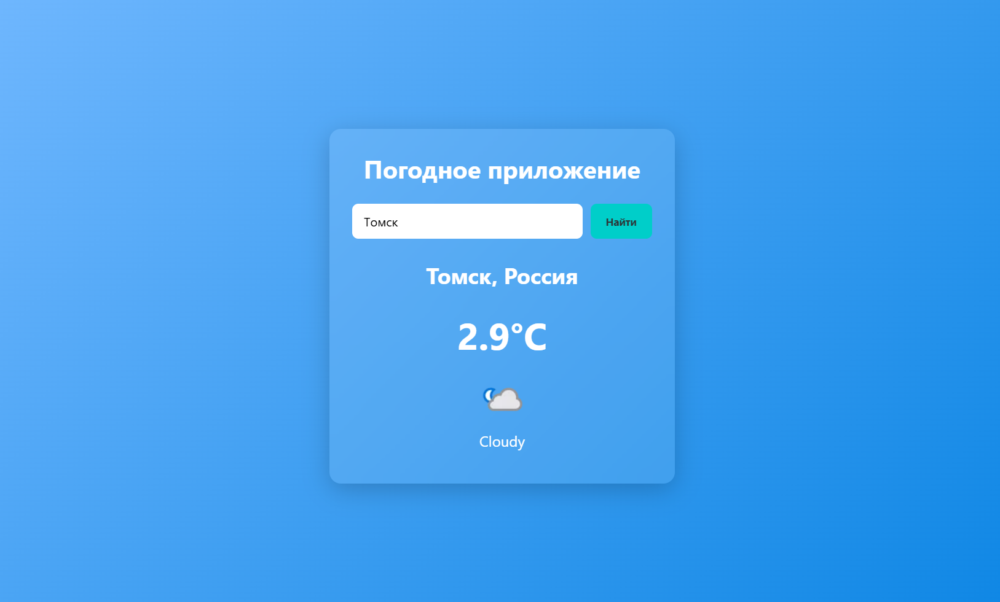

# 🌤️ Простое приложение "Прогноз погоды"

Приложение позволяет узнать текущую погоду в любом городе мира.

## 🚀 Демо

Посмотреть работающее приложение можно по ссылке: [тык](https://mineralins.github.io/weather-app/)

## 📸 Скриншот

 

## 🛠️ Технологии

- **HTML5** - для структуры приложения
- **CSS3** - для стилизации и адаптивного дизайна
- **JavaScript (ES6+)** - для интерактивности и логики
- **WeatherAPI** - для получения данных о погоде
- **Git & GitHub** - для контроля версий и хостинга

## ✨ Функциональность

- Поиск погоды по названию города
- Отображение текущей температуры (в °C)
- Показ состояния неба (например, "Солнечно", "Облачно")
- Отображение иконки погоды
- Адаптивный дизайн, который хорошо выглядит на телефонах и компьютерах

## 📄 Лицензия

Этот проект распространяется по лицензии MIT. См. файл `LICENSE` для подробностей.